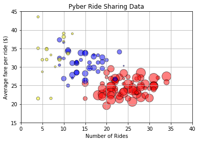
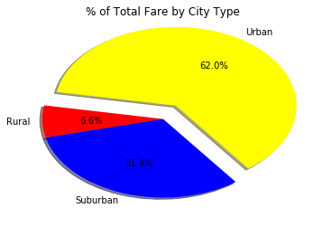
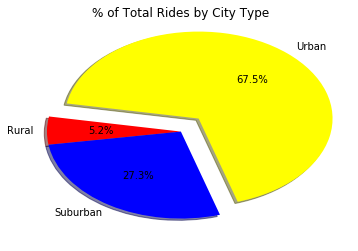
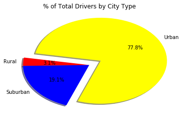

# Pyber Ride Sharing
## Analysis
* The more demands of rides per city, on average the less it will cost per ride.
* Urban areas are where majority of the activites (rides) occurs.
* Total number of drivers is greater as there are more rides occuring in the city


```python
import matplotlib.pyplot as plt
import numpy as np
import pandas as pd
import seaborn as sns
import os
import csv 

csv = os.path.join('Resources','city_data.csv')
csv1 = os.path.join('Resources','ride_data.csv')
city_df = pd.read_csv(csv)
ride_df = pd.read_csv(csv1)
city_df.head()
```


<div>
<style scoped>
    .dataframe tbody tr th:only-of-type {
        vertical-align: middle;
    }

    .dataframe tbody tr th {
        vertical-align: top;
    }

    .dataframe thead th {
        text-align: right;
    }
</style>
<table border="1" class="dataframe">
  <thead>
    <tr style="text-align: right;">
      <th></th>
      <th>city</th>
      <th>driver_count</th>
      <th>type</th>
    </tr>
  </thead>
  <tbody>
    <tr>
      <th>0</th>
      <td>Kelseyland</td>
      <td>63</td>
      <td>Urban</td>
    </tr>
    <tr>
      <th>1</th>
      <td>Nguyenbury</td>
      <td>8</td>
      <td>Urban</td>
    </tr>
    <tr>
      <th>2</th>
      <td>East Douglas</td>
      <td>12</td>
      <td>Urban</td>
    </tr>
    <tr>
      <th>3</th>
      <td>West Dawnfurt</td>
      <td>34</td>
      <td>Urban</td>
    </tr>
    <tr>
      <th>4</th>
      <td>Rodriguezburgh</td>
      <td>52</td>
      <td>Urban</td>
    </tr>
  </tbody>
</table>
</div>


```python
pyber_df = pd.merge(ride_df,city_df,on = "city",how = "left")
pyber_df.head()
```


<div>
<style scoped>
    .dataframe tbody tr th:only-of-type {
        vertical-align: middle;
    }

    .dataframe tbody tr th {
        vertical-align: top;
    }

    .dataframe thead th {
        text-align: right;
    }
</style>
<table border="1" class="dataframe">
  <thead>
    <tr style="text-align: right;">
      <th></th>
      <th>city</th>
      <th>date</th>
      <th>fare</th>
      <th>ride_id</th>
      <th>driver_count</th>
      <th>type</th>
    </tr>
  </thead>
  <tbody>
    <tr>
      <th>0</th>
      <td>Sarabury</td>
      <td>2016-01-16 13:49:27</td>
      <td>38.35</td>
      <td>5403689035038</td>
      <td>46</td>
      <td>Urban</td>
    </tr>
    <tr>
      <th>1</th>
      <td>South Roy</td>
      <td>2016-01-02 18:42:34</td>
      <td>17.49</td>
      <td>4036272335942</td>
      <td>35</td>
      <td>Urban</td>
    </tr>
    <tr>
      <th>2</th>
      <td>Wiseborough</td>
      <td>2016-01-21 17:35:29</td>
      <td>44.18</td>
      <td>3645042422587</td>
      <td>55</td>
      <td>Urban</td>
    </tr>
    <tr>
      <th>3</th>
      <td>Spencertown</td>
      <td>2016-07-31 14:53:22</td>
      <td>6.87</td>
      <td>2242596575892</td>
      <td>68</td>
      <td>Urban</td>
    </tr>
    <tr>
      <th>4</th>
      <td>Nguyenbury</td>
      <td>2016-07-09 04:42:44</td>
      <td>6.28</td>
      <td>1543057793673</td>
      <td>8</td>
      <td>Urban</td>
    </tr>
  </tbody>
</table>
</div>


```python
#Finding avg fare per city
cityFare_avg = pyber_df.groupby(["city"]).mean()
cityFare_avg = cityFare_avg.reset_index()
cityFare_avg = pd.DataFrame(cityFare_avg,columns=['city','fare'])
cityFare_avg.columns=['city','Average Fare per ride']
cityFare_avg.head()
```


<div>
<style scoped>
    .dataframe tbody tr th:only-of-type {
        vertical-align: middle;
    }

    .dataframe tbody tr th {
        vertical-align: top;
    }

    .dataframe thead th {
        text-align: right;
    }
</style>
<table border="1" class="dataframe">
  <thead>
    <tr style="text-align: right;">
      <th></th>
      <th>city</th>
      <th>Average Fare per ride</th>
    </tr>
  </thead>
  <tbody>
    <tr>
      <th>0</th>
      <td>Alvarezhaven</td>
      <td>23.928710</td>
    </tr>
    <tr>
      <th>1</th>
      <td>Alyssaberg</td>
      <td>20.609615</td>
    </tr>
    <tr>
      <th>2</th>
      <td>Anitamouth</td>
      <td>37.315556</td>
    </tr>
    <tr>
      <th>3</th>
      <td>Antoniomouth</td>
      <td>23.625000</td>
    </tr>
    <tr>
      <th>4</th>
      <td>Aprilchester</td>
      <td>21.981579</td>
    </tr>
  </tbody>
</table>
</div>


```python
#Finding Ride Counts per city
cityRide_ct = pyber_df.groupby(["city"]).count()
cityRide_ct = cityRide_ct.reset_index()
cityRide_ct = pd.DataFrame(cityRide_ct,columns=['city','ride_id'])
cityRide_ct.columns = ['city','Ride Counts']
cityRide_ct.head()
```


<div>
<style scoped>
    .dataframe tbody tr th:only-of-type {
        vertical-align: middle;
    }

    .dataframe tbody tr th {
        vertical-align: top;
    }

    .dataframe thead th {
        text-align: right;
    }
</style>
<table border="1" class="dataframe">
  <thead>
    <tr style="text-align: right;">
      <th></th>
      <th>city</th>
      <th>Ride Counts</th>
    </tr>
  </thead>
  <tbody>
    <tr>
      <th>0</th>
      <td>Alvarezhaven</td>
      <td>31</td>
    </tr>
    <tr>
      <th>1</th>
      <td>Alyssaberg</td>
      <td>26</td>
    </tr>
    <tr>
      <th>2</th>
      <td>Anitamouth</td>
      <td>9</td>
    </tr>
    <tr>
      <th>3</th>
      <td>Antoniomouth</td>
      <td>22</td>
    </tr>
    <tr>
      <th>4</th>
      <td>Aprilchester</td>
      <td>19</td>
    </tr>
  </tbody>
</table>
</div>


```python
#Merge table for Pyber Ride Sharing Data
RideShare_df = pd.merge(city_df,cityFare_avg,on = 'city', how ='left')
RideShare_df = pd.merge(RideShare_df, cityRide_ct,on='city',how = 'left')
RideShare_df.head()
```


<div>
<style scoped>
    .dataframe tbody tr th:only-of-type {
        vertical-align: middle;
    }

    .dataframe tbody tr th {
        vertical-align: top;
    }

    .dataframe thead th {
        text-align: right;
    }
</style>
<table border="1" class="dataframe">
  <thead>
    <tr style="text-align: right;">
      <th></th>
      <th>city</th>
      <th>driver_count</th>
      <th>type</th>
      <th>Average Fare per ride</th>
      <th>Ride Counts</th>
    </tr>
  </thead>
  <tbody>
    <tr>
      <th>0</th>
      <td>Kelseyland</td>
      <td>63</td>
      <td>Urban</td>
      <td>21.806429</td>
      <td>28</td>
    </tr>
    <tr>
      <th>1</th>
      <td>Nguyenbury</td>
      <td>8</td>
      <td>Urban</td>
      <td>25.899615</td>
      <td>26</td>
    </tr>
    <tr>
      <th>2</th>
      <td>East Douglas</td>
      <td>12</td>
      <td>Urban</td>
      <td>26.169091</td>
      <td>22</td>
    </tr>
    <tr>
      <th>3</th>
      <td>West Dawnfurt</td>
      <td>34</td>
      <td>Urban</td>
      <td>22.330345</td>
      <td>29</td>
    </tr>
    <tr>
      <th>4</th>
      <td>Rodriguezburgh</td>
      <td>52</td>
      <td>Urban</td>
      <td>21.332609</td>
      <td>23</td>
    </tr>
  </tbody>
</table>
</div>


```python
RideShare_df['type'].value_counts()
```


    Urban       66
    Suburban    42
    Rural       18
    Name: type, dtype: int64


```python
conditions = [
    (RideShare_df['type']=='Urban'),
    (RideShare_df['type']=='Suburban'),
    (RideShare_df['type']=='Rural')
]
colors = ['red','blue','yellow']
RideShare_df['color'] = np.select(conditions, colors,default = 'black')
RideShare_df.dtypes
```


    city                      object
    driver_count               int64
    type                      object
    Average Fare per ride    float64
    Ride Counts                int64
    color                     object
    dtype: object


```python
#Plot scatter
x_axis = RideShare_df['Ride Counts']
y_axis = RideShare_df['Average Fare per ride']
plt.scatter(x_axis,y_axis,s=RideShare_df['driver_count']*5,c=RideShare_df['color'],edgecolors="black",alpha=0.5,linewidth = 1)
#Set Aesthetics

plt.xlim(0,40)
plt.ylim(15,45)
plt.grid()
plt.title("Pyber Ride Sharing Data")
plt.xlabel("Number of Rides")
plt.ylabel("Average fare per ride ($)")

```


    Text(0,0.5,'Average fare per ride ($)')





```python
#Grouping by city type totals
citytype_sum = pyber_df.groupby(["type"]).sum()
total_fare = citytype_sum['fare'].sum()
citytype_sum['% of total fare'] = citytype_sum['fare']/total_fare*100
citytype_sum = pd.DataFrame(citytype_sum,columns=['fare','% of total fare'])
citytype_sum = citytype_sum.reset_index()
#Grouping by city type by counts
citytype_ct = pyber_df.groupby(["type"]).count()
total_rides = citytype_ct['ride_id'].sum()
citytype_ct['% of total rides'] = citytype_ct['ride_id']/total_rides*100
citytype_ct = pd.DataFrame(citytype_ct,columns=['ride_id','% of total rides'])
citytype_ct.columns=['Total Rides','% of Total Rides']
citytype_ct = citytype_ct.reset_index()
citytype_ct

```


<div>
<style scoped>
    .dataframe tbody tr th:only-of-type {
        vertical-align: middle;
    }

    .dataframe tbody tr th {
        vertical-align: top;
    }

    .dataframe thead th {
        text-align: right;
    }
</style>
<table border="1" class="dataframe">
  <thead>
    <tr style="text-align: right;">
      <th></th>
      <th>type</th>
      <th>Total Rides</th>
      <th>% of Total Rides</th>
    </tr>
  </thead>
  <tbody>
    <tr>
      <th>0</th>
      <td>Rural</td>
      <td>125</td>
      <td>5.193187</td>
    </tr>
    <tr>
      <th>1</th>
      <td>Suburban</td>
      <td>657</td>
      <td>27.295388</td>
    </tr>
    <tr>
      <th>2</th>
      <td>Urban</td>
      <td>1625</td>
      <td>67.511425</td>
    </tr>
  </tbody>
</table>
</div>


```python
#Grouping by city type by driver counts
driver_ct = RideShare_df.groupby(['type']).sum()
total_drivers = driver_ct['driver_count'].sum()
driver_ct['% of Total Drivers'] = driver_ct['driver_count']/total_drivers*100
driver_ct = pd.DataFrame(driver_ct,columns = ['driver_count','% of Total Drivers'])
driver_ct.columns=['Total Drivers', '% of Total Drivers']
driver_ct = driver_ct.reset_index()
driver_ct
```


<div>
<style scoped>
    .dataframe tbody tr th:only-of-type {
        vertical-align: middle;
    }

    .dataframe tbody tr th {
        vertical-align: top;
    }

    .dataframe thead th {
        text-align: right;
    }
</style>
<table border="1" class="dataframe">
  <thead>
    <tr style="text-align: right;">
      <th></th>
      <th>type</th>
      <th>Total Drivers</th>
      <th>% of Total Drivers</th>
    </tr>
  </thead>
  <tbody>
    <tr>
      <th>0</th>
      <td>Rural</td>
      <td>104</td>
      <td>3.105405</td>
    </tr>
    <tr>
      <th>1</th>
      <td>Suburban</td>
      <td>638</td>
      <td>19.050463</td>
    </tr>
    <tr>
      <th>2</th>
      <td>Urban</td>
      <td>2607</td>
      <td>77.844133</td>
    </tr>
  </tbody>
</table>
</div>


```python
#Merge all city type tables
Citytype_Analysis = pd.merge(citytype_sum, citytype_ct, on = 'type',how = 'left')
Citytype_Analysis = pd.merge(Citytype_Analysis,driver_ct,on='type',how = 'left')
Citytype_Analysis
```


<div>
<style scoped>
    .dataframe tbody tr th:only-of-type {
        vertical-align: middle;
    }

    .dataframe tbody tr th {
        vertical-align: top;
    }

    .dataframe thead th {
        text-align: right;
    }
</style>
<table border="1" class="dataframe">
  <thead>
    <tr style="text-align: right;">
      <th></th>
      <th>type</th>
      <th>fare</th>
      <th>% of total fare</th>
      <th>Total Rides</th>
      <th>% of Total Rides</th>
      <th>Total Drivers</th>
      <th>% of Total Drivers</th>
    </tr>
  </thead>
  <tbody>
    <tr>
      <th>0</th>
      <td>Rural</td>
      <td>4255.09</td>
      <td>6.579786</td>
      <td>125</td>
      <td>5.193187</td>
      <td>104</td>
      <td>3.105405</td>
    </tr>
    <tr>
      <th>1</th>
      <td>Suburban</td>
      <td>20335.69</td>
      <td>31.445750</td>
      <td>657</td>
      <td>27.295388</td>
      <td>638</td>
      <td>19.050463</td>
    </tr>
    <tr>
      <th>2</th>
      <td>Urban</td>
      <td>40078.34</td>
      <td>61.974463</td>
      <td>1625</td>
      <td>67.511425</td>
      <td>2607</td>
      <td>77.844133</td>
    </tr>
  </tbody>
</table>
</div>


```python
#Pie Chart (% of total fare by city type)
labels = ['Rural','Suburban','Urban']
pie_color = ['yellow','blue','red']
explode = [0,0,0.2]
plt.pie(citytype_sum['% of total fare'],explode = explode,labels = labels,colors = colors,autopct="%1.1f%%", shadow=True, startangle=170)
plt.title("% of Total Fare by City Type")
plt.show()
```





```python
#Pie Chart (% of total rides by city type)
plt.pie(Citytype_Analysis['% of Total Rides'],explode = explode,labels = labels,colors = colors,autopct="%1.1f%%", shadow=True, startangle=170)
plt.title("% of Total Rides by City Type")
plt.show()
```





```python
#Pie Chart (% of total drivers by city type)
plt.pie(Citytype_Analysis['% of Total Drivers'],explode = explode,labels = labels,colors = colors,autopct="%1.1f%%", shadow=True, startangle=170)
plt.title("% of Total Drivers by City Type")
plt.show()
```




